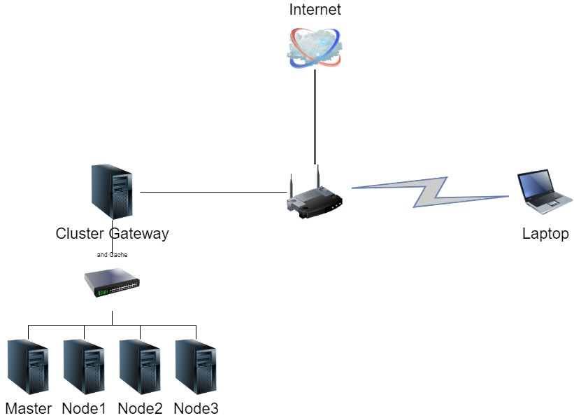

One of the great things about modern cloud development is how quickly you can get a [kubernetes](https://kubernetes.io/) cluster up and running quickly and easily, but it hides a lot of the detail and nuts and bolts involved in the setup. So I wanted to go back to basics (but still pretty advanced) and spin up my own cluster on bare metal from the ground up. It would also be pretty cool to have a portable plug-and-play cluster which you can plugin into a network and start using it. A portable kubernetes cluster appliance as it were!

My plan is to build a 4 Node cluster (RPi 4B) (1 master, 3 workers) with an additional (RPi 4B) configured as an `apt` cache to reduce the time taken to setup multiple identical Pi's. Since RPi's use an SDCard for storage I want to reduce the number of writes, so I'm going to install Log2Ram which mounts the default `/var/logs/` to a ramdisk, I'll also install a USB stick which will be mounted for storage.

# Shopping List

This a run down of the bits that I purchased, but shop around as I ended up with lots of extra cables and took advantage of seasonal offers. These are affiliate links:

- 5 x [Raspberry Pi 4B](https://amzn.to/3266Uta)
- 5 x [32GB Micro SD Cards](https://amzn.to/2SCrSN6)
- 5 x [64GB USB Sticks](https://amzn.to/37A60q9)
- 5 x [Flat cat6 Ethernet Cables](https://amzn.to/3bPZHC8)
- 4 x [Short USB C -> USB A Cables](https://amzn.to/2STN4NH)
- 1 x [Longer USB C -> USB A Cable](https://amzn.to/2uVr7G1)
- 1 x [USB Powered 5 Port Network Switch](https://amzn.to/2vLmkXA)
- 1 x [10 Port USB Wall Charger](https://amzn.to/39Gpf2s)
- 1 x [4x RPi Cluster Case](https://amzn.to/3bQugr5) - 120mm fan cools all RPi's and has a handle
- 1 x [RPi Passive Cooling Case](https://amzn.to/39OoKUn)
- 1 x [USB Ethernet Adapter](https://amzn.to/2SYK1nt)

> I also brought a Quieter 120mm fan to replace the brightly coloured jet turbine that came with the cluster case [Noctua 120mm Silent Fan](https://amzn.to/2uMHmFu). If anyone follows suit, I needed to rewire the power headers for the fan (black => black , red=> yellow - remove the blue and green wires)

Assembling the RPi's is fairly straight forward and a few warranty-voiding minutes with a hot glue gun, I'd mounted the USB Charger and 5 Port Switch, Gateway/Cache RPi and USB ethernet adapter to the chassis. The result isn't the neatest bit of work, but it only needs a single power cable and an optional ethernet cable to "install".

My plan is to hang the cluster from hooks under a desk by its handle so all in the assembly was pretty easy and successful. Now comes the configuration and setup :).

