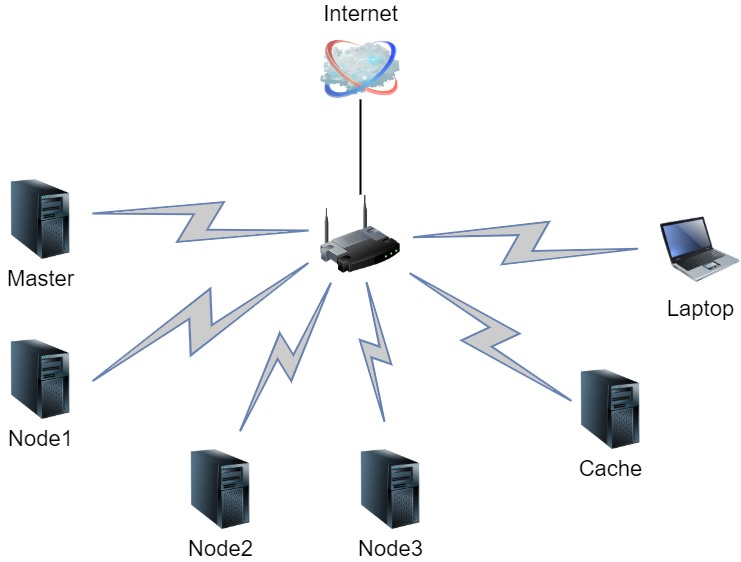

# Basic Installation and Configuration

Before I get going on the Kubernetes proper I wanted to make sure all the PI's are essentially configured and update to date. There are lots of guides out there for providing more detail, but the steps I'm running through are:

- Write the latest Raspbian Lite image to the MicroSD Cards ([Official Guide](https://www.raspberrypi.org/documentation/installation/installing-images/README.md))
- Enable headless install by enabling SSH access and providing WIFI details so RPi's can boot and be available on network ([Official Guide](https://www.raspberrypi.org/documentation/configuration/wireless/headless.md))
- Use DHCP (but with assigned IP's from router)

From this basic connectivity setup, will continue onto:

- Configure hostnames
- Configure the Gateway/Cache RPi to act as an `apt` caching using [`apt-cacher-ng`](https://geekflare.com/create-apt-proxy-on-raspberrypi/)
- Configure all RPi's Apt clients to use the `apt-cacher-ng` service
- Configure all RPi's to log to ram by default ([Log2Ram](https://github.com/azlux/log2ram))
- Bring all the RPi's up to date
- Mount USB Drive

At this point, I'll have all the RPi's communicating and up to date, but on my WIFI. This is great for the initial setup as I can connect to each RPi and configure in isolation. Ideally, I want the cluster to be on it's own network segment and with Ethernet connectivity between the nodes.

- Switch cluster from WIFI to Ethernet with local switch
- Configure RPi 3b to act as gateway/firewall
- Deploy kubernetes

# Basic Customisation

After the RPi's have been flashed and are on the WiFi network, discover the assigned IP address of the RPi and connect using `ssh pi@<ip>` ( or [Putty](https://www.putty.org)). Expect to get a warning asking if you want to continue, this is a one off and after you accept you won't be prompted again

```plain
The authenticity of host '<ip> (<ip>)' can't be established.
ECDSA key fingerprint is SHA256:sSbB1s3IpXMon5yZTE2tIV/IdwuwYc0hDQaRKZhQXbM.
Are you sure you want to continue connecting (yes/no)?
```

First thing to do is to update the default password (`passwd`)/create a new user and disable the default `pi` login.

> It's also a great idea to use key based authentication rather than a password... [instructions](https://www.digitalocean.com/community/tutorials/how-to-configure-ssh-key-based-authentication-on-a-linux-server)

## Configure Basic Node Setting

Next, we need to to change the default hostname from `raspberrypi` to something more distinctive. We'll need to change this in two places:

```bash
sudo nano /etc/hostname
sudo nano /etc/hosts
```

In both files replace `raspberrypi` with your chosen name.

> in my case, I am to use the same RPi for caching and as a gateway so for that RPi I've updated the line in `/etc/hosts` to be:
>
> ```plain
> 127.0.1.1       gateway cache
> ```
>
> This will mean it will resolve both `gateway` and >`cache` to the local machine.
>
> For every other node append the line to `/etc/hosts`:
>
> ```plain
> <cache-ip>       gateway cache
> ```
>
> This means that we can easily introduce a new gateway RPi if required later.

Reboot using `sudo reboot`. Within a few seconds you should be able to reconnect with your updated credentials.

If alls worked the prompt should now reflect your new hostname and you should be able to get successful ping response:

```plain
<new-user>@<new-hostname>:~ $ ping <new-hostname>
PING <new-hostname> (<ip>) 56(84) bytes of data.
64 bytes from <new-hostname> (<ip>): icmp_seq=1 ttl=64 time=725 ms
64 bytes from <new-hostname> (<ip>): icmp_seq=2 ttl=64 time=5.80 ms
64 bytes from <new-hostname> (<ip>): icmp_seq=3 ttl=64 time=8.72 ms
```

> If your configuring the cache configure `apt-cacher-ng` install it now with `sudo apt install apt-cacher-ng`.
>
> When prompted select `No` to allowing HTTPS Tunnels.
>
> You can see a report of how much bandwidth you've saved by visiting `http://<cache-ip>:3142/acng-report.html`

## Configure APT Cache

We now need to configure `apt` to use our cache RPi. To do this modify:

```bash
sudo nano /etc/apt/sources.list
```

and all files in `/etc/apt/sources.list.d` (should just be `raspi.list`) to redirect the requests to the cache server by adding `cache:3142/` after the `http://` for each uncommented line :

So

```plain
deb http://raspbian.raspberrypi.org/raspbian/ buster main contrib non-free rpi
```

becomes:

```plain
deb http://cache:3142/raspbian.raspberrypi.org/raspbian/ buster main contrib non-free rpi
```

You should now see the calls to the cache RPi when you run `sudo apt update`.

```plain
pi@node3:~ $ sudo apt update
Get:1 http://cache:3142/raspbian.raspberrypi.org/raspbian buster InRelease [15.0 kB]
Get:2 http://cache:3142/archive.raspberrypi.org/debian buster InRelease [25.1 kB]
Get:3 http://cache:3142/packages.azlux.fr/debian buster InRelease [3,983 B]
Get:4 http://cache:3142/raspbian.raspberrypi.org/raspbian buster/main armhf Packages [13.0 MB]
Get:5 http://cache:3142/raspbian.raspberrypi.org/raspbian buster/contrib armhf Packages [58.7 kB]
Get:5 http://cache:3142/raspbian.raspberrypi.org/raspbian buster/contrib armhf Packages [58.7 kB]
Get:7 http://cache:3142/raspbian.raspberrypi.org/raspbian buster/non-free armhf Packages [103 kB]
Get:8 http://cache:3142/raspbian.raspberrypi.org/raspbian buster/rpi armhf Packages [1,360 B]
Get:9 http://cache:3142/archive.raspberrypi.org/debian buster/main armhf Packages [277 kB]
Fetched 13.5 MB in 13s (1,077 kB/s)
Reading package lists... Done
Building dependency tree
Reading state information... Done
73 packages can be upgraded. Run 'apt list --upgradable' to see them.
```

Run `sudo apt upgrade` to update to the latest versions.

## Enable Logs Ram Disk

We can now install `log2ram` using the following (replace `cache` with the appropriate hostname):

```bash
echo "deb http://cache:3142/packages.azlux.fr/debian/ buster main" | sudo tee /etc/apt/sources.list.d/azlux.list
wget -qO - https://azlux.fr/repo.gpg.key | sudo apt-key add -
sudo apt update
sudo apt install log2ram
```

Reboot the RPi with `sudo reboot` and reconnect. Execute `df` and you should see a line similar to:

```plain
Filesystem     1K-blocks    Used Available Use% Mounted on
...
log2ram            40960     756     40204   2% /var/log
...
```

## Mounting the USB Drive

To keep the cluster stable we want to avoid avoid churning of data of the SD Card, so to this end we're going to mount a USB stick for the RPi to use.

- Plug in the stick
- Check you can see the new drive by `ls -l /dev/disk/by-uuid/`. It should be assigned as `sda*` (probably 1)

```plain
total 0
lrwxrwxrwx 1 root root 15 Feb 17 13:19 2ab3f8e1-7dc6-43f5-b0db-dd5759d51d4e -> ../../mmcblk0p2
lrwxrwxrwx 1 root root 10 Feb 17 15:17 47B0-D842 -> ../../sda1
lrwxrwxrwx 1 root root 15 Feb 17 13:19 5203-DB74 -> ../../mmcblk0p1
```

- Reformat the USB Stick to ext4 (FAT doesn't support permissions)
  - `sudo fdisk /dev/sda`
    - `d` - to delete all the existing partitions
    - `n` - to create a new partition
    - `p` - primary partition
    - `1` - first partition
    - `<enter>` - accept default start sector
    - `<enter>` - accept default end sector
    - `w` - write changes and exit
  - `sudo mkfs -t ext4 /dev/sda1` - format the new partition
- Create a new folder to mount the disk to `sudo mkdir /mnt/usb`
- Make a note of the UUID of the new partition (`sudo blkid /dev/sda1`)
- Edit fstab (`sudo nano /etc/fstab`) and add a line similar to the one below, but replace the UUID for the new partition:

```plain
UUID=<your-uuid> /mnt/usb ext4 defaults 0 0
```

- Mount the disk `sudo mount -a`
- Change owner from root (`sudo chown -R $USER:$USER /mnt/usb`)
- Reboot to double check that disk mounts as expected (`sudo reboot`)

#### Move APT Cache to USB

We can now move the APT cache over to the mounted USB Stick, we'll do this by moving the files and then creating a bind mount between the original location and new location so that we can leave config files as is. Before you start check the contents of `/var/cache` so you can confirm all is working after the move:

```bash
sudo ls /var/cache -al
sudo mv /var/cache /mnt/usb/
sudo mkdir /var/cache
sudo nano /etc/fstab
```

Then append the line:

```plain
/mnt/usb/cache  /var/cache      none    bind    0 0
```

Save the file and then:

```bash
sudo mount -a`
sudo ls /var/cache -al
```

This should then mount cache folder from the USB drive to the original location if the file tree and list the directory contents (which should match from before).

Finally, test that `apt` still works as expected: with `sudo apt get update`. There shouldn't be any errors.

## Installing Docker

The cluster nodes will all need Docker installed as a Kubernetes pre-requisite and the cache RPi will need it to serve as a read-through cache Docker Repo.

On each RPi, install docker with (leveraging the apt cache):

```bash
sudo apt-get update -qq >/dev/null && \
DEBIAN_FRONTEND=noninteractive sudo apt-get install -y -qq apt-transport-https ca-certificates curl >/dev/null && \
curl -fsSL https://download.docker.com/linux/raspbian/gpg | sudo apt-key add -qq - >/dev/null && \
echo "deb [arch=$(dpkg --print-architecture)] http://cache:3142/HTTPS///download.docker.com/linux/raspbian buster stable" | sudo tee /etc/apt/sources.list.d/docker.list && \
sudo apt-get update -qq >/dev/null && \
sudo apt-get install -y -qq --no-install-recommends docker-ce-cli && \
sudo apt-get install -y -qq --no-install-recommends docker-ce && \
sudo usermod pi -aG docker && \
newgrp docker
```

> To use the non-cached official installer:
>
> ```bash
> curl -sSL get.docker.com | sh && \
> sudo usermod pi -aG docker && \
> newgrp docker
> ```

You can test that docker has installed correctly by `docker --version` you should see output similar to:

```plain
Docker version 19.03.6, build 369ce74
```

For improved compatibility, disable swap for kubernetes compatibility:

```bash
sudo dphys-swapfile swapoff && \
sudo dphys-swapfile uninstall && \
sudo update-rc.d dphys-swapfile remove && \
sudo systemctl disable dphys-swapfile.service
```

We also need to enable the following cgroups, by appending the parameters below to `/boot/cmdline.txt` (`sudo nano /boot/cmdline.txt`) this should all be on one line.

```plain
cgroup_enable=cpuset cgroup_memory=1 cgroup_enable=memory
```

Reboot the RPi `sudo reboot`

## Configure Docker Cache on Cache RPi

> For more details see [Official Docs](https://docs.docker.com/registry/recipes/mirror/)

SSH into the Cache RPi and verify docker is running:

```bash
docker ps
```

Create a directory to store cached docker images:

```bash
sudo mkdir /mnt/usb/docker-cache
```

Download the official Docker Repository Repo and export the latest config for modification:

```bash
sudo docker run -it --rm registry cat /etc/docker/registry/config.yml | sudo tee /mnt/usb/docker-cache/config.yml
```

This should result in `/mnt/usb/docker-cache/config.yml` containing something similar to:

```plain
version: 0.1
log:
  fields:
    service: registry
storage:
  cache:
    blobdescriptor: inmemory
  filesystem:
    rootdirectory: /var/lib/registry
http:
  addr: :5000
  headers:
    X-Content-Type-Options: [nosniff]
health:
  storagedriver:
    enabled: true
    interval: 10s
    threshold: 3
```

Append the proxy configuration to the end of the config:

```plain
proxy:
  remoteurl: https://registry-1.docker.io
```

We can now start the caching private repo set to always start with the docker daemon:

```bash
sudo docker run --restart=always -p 5000:5000 \
         --name repo-cache -v /mnt/usb/docker-cache:/var/lib/registry \
         --detach registry serve /var/lib/registry/config.yml
```

You can monitor the running process with `docker ps`, you can also query the current repo contents with:

```bash
$ curl http://cache:5000/v2/_catalog
{"repositories":[]}
```

We need to update all the nodes to refer to the caching repo by creating `/etc/docker/daemon.json` (`sudo nano /etc/docker/daemon.json`) with the contents:

```json
{
  "registry-mirrors": ["http://cache:5000"]
}
```

and restart Docker

```bash
sudo service docker restart
```

You can then pull a docker image to check the caching is working:

```bash
$ docker pull hello-world
...
$ docker pull redis
...
$ $ curl http://cache:5000/v2/_catalog
{"repositories":["library/hello-world","library/redis"]}
```

You should notice after the first node has pulled an image, the other nodes can download at a much faster rate due to pulling straight from the cache.

## Install Kubernetes CLI Tools

Install the common CLI tooling on each of the RPi's:

```bash
echo "deb http://cache:3142/apt.kubernetes.io/ kubernetes-xenial main" | sudo tee /etc/apt/sources.list.d/kubernetes.list
wget -qO - https://packages.cloud.google.com/apt/doc/apt-key.gpg | sudo apt-key add -
sudo apt-get update
sudo apt-get install -qy kubeadm
```

# Summary

So far this has gotten us to:



The RPi's are working with a pull through apt cache and private docker repository, but no kubernetes cluster and all network comms is over WIFI not a faster Ethernet backbone. I'll be looking to address this next.
